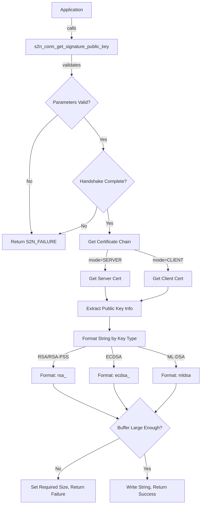

# Design Document: s2n_conn_get_signature_public_key API

## Overview

This document describes the design for a new public API `s2n_conn_get_signature_public_key()` that returns a human-readable string describing the certificate signing algorithm and key parameters of the leaf certificate negotiated during a TLS handshake. The API extracts information from the X.509 certificate's public key and formats it according to the key type (RSA, ECDSA, or ML-DSA).

## Architecture

The API follows s2n-tls's existing patterns for connection getter functions:



## Components and Interfaces

### Public API Declaration (api/s2n.h)

```c
/**
 * Gets a string describing the public key algorithm and parameters of the 
 * leaf certificate for the specified connection mode.
 *
 * @param conn The s2n connection
 * @param mode S2N_SERVER for server certificate, S2N_CLIENT for client certificate
 * @param output Buffer to write the null-terminated result string
 * @param output_size On input, the size of the output buffer. On output, the 
 *                    number of bytes written (including null terminator), or 
 *                    the required size if the buffer is too small.
 *
 * @returns S2N_SUCCESS on success. S2N_FAILURE on failure.
 *
 * The returned string format depends on the key type:
 * - RSA: "rsa_2048", "rsa_3072", "rsa_4096", or "rsa_<keysize>" for other sizes
 * - ECDSA: "ecdsa_secp256r1", "ecdsa_secp384r1", "ecdsa_secp521r1"
 * - ML-DSA: "mldsa44", "mldsa65", "mldsa87"
 */
S2N_API extern int s2n_conn_get_signature_public_key(
    struct s2n_connection *conn,
    s2n_mode mode,
    char *output,
    uint32_t *output_size);
```

### Internal Implementation (tls/s2n_connection.c)

The implementation will:
1. Validate input parameters
2. Check handshake completion state
3. Retrieve the appropriate certificate based on mode
4. Extract public key information using existing s2n infrastructure
5. Format the output string based on key type
6. Handle buffer size constraints

### Key Type to String Mapping

| Key Type | NID | Output Format |
|----------|-----|---------------|
| RSA | NID_rsaEncryption | `rsa_<bits>` |
| RSA-PSS | NID_rsassaPss | `rsa_<bits>` |
| ECDSA secp256r1 | NID_X9_62_prime256v1 | `ecdsa_secp256r1` |
| ECDSA secp384r1 | NID_secp384r1 | `ecdsa_secp384r1` |
| ECDSA secp521r1 | NID_secp521r1 | `ecdsa_secp521r1` |
| ML-DSA-44 | NID_MLDSA44 | `mldsa44` |
| ML-DSA-65 | NID_MLDSA65 | `mldsa65` |
| ML-DSA-87 | NID_MLDSA87 | `mldsa87` |

## Data Models

### Existing Structures Used

The implementation leverages existing s2n data structures:

- `struct s2n_connection`: Contains handshake state and certificate information
- `struct s2n_cert_chain_and_key`: Holds the certificate chain
- `struct s2n_cert`: Individual certificate with `pkey_type` and `info` fields
- `struct s2n_cert_info`: Contains `public_key_nid` and `public_key_bits`

### Maximum Output String Length

The maximum output string length is bounded:
- RSA: `rsa_` (4) + max digits for key size (5 for 65536) + null = 10 bytes
- ECDSA: `ecdsa_secp521r1` (15) + null = 16 bytes
- ML-DSA: `mldsa87` (7) + null = 8 bytes

Maximum buffer requirement: 16 bytes (for `ecdsa_secp521r1\0`)

## Correctness Properties

*A property is a characteristic or behavior that should hold true across all valid executions of a system-essentially, a formal statement about what the system should do. Properties serve as the bridge between human-readable specifications and machine-verifiable correctness guarantees.*

Based on the prework analysis, the following properties can be verified through property-based testing:

### Property 1: Valid output is always null-terminated
*For any* valid connection with a completed handshake and sufficient buffer, the output string SHALL be null-terminated and non-empty.
**Validates: Requirements 1.1**

### Property 2: RSA key format consistency
*For any* RSA or RSA-PSS certificate with key size N bits, the output string SHALL match the pattern `rsa_<N>` where N is the decimal representation of the key size.
**Validates: Requirements 2.4, 2.5**

### Property 3: Buffer too small reports required size
*For any* valid certificate and buffer smaller than required, the function SHALL return S2N_FAILURE and set output_size to the required buffer size.
**Validates: Requirements 5.1, 6.2**

### Property 4: Sufficient buffer always succeeds
*For any* valid certificate and buffer size >= required size, the function SHALL return S2N_SUCCESS and write the complete string.
**Validates: Requirements 5.2, 5.3**

### Property 5: Output size equals string length plus one
*For any* successful call, the output_size parameter SHALL equal `strlen(output) + 1`.
**Validates: Requirements 6.1**

### Property 6: Mode parameter selects correct certificate
*For any* connection with both client and server certificates, specifying S2N_SERVER mode SHALL return server certificate info, and S2N_CLIENT mode SHALL return client certificate info.
**Validates: Requirements 7.1, 7.2**

## Error Handling

The API uses s2n-tls's standard error handling patterns:

| Condition | Error Code | Behavior |
|-----------|------------|----------|
| NULL connection | S2N_ERR_NULL | Return S2N_FAILURE |
| NULL output buffer | S2N_ERR_NULL | Return S2N_FAILURE |
| NULL output_size | S2N_ERR_NULL | Return S2N_FAILURE |
| Handshake incomplete | S2N_ERR_HANDSHAKE_NOT_COMPLETE | Return S2N_FAILURE |
| No certificate available | S2N_ERR_NO_CERT_FOUND | Return S2N_FAILURE |
| Buffer too small | S2N_ERR_INSUFFICIENT_MEM_SIZE | Set required size, return S2N_FAILURE |
| Unknown key type | S2N_ERR_CERT_TYPE_UNSUPPORTED | Return S2N_FAILURE |

## Testing Strategy

### Unit Tests

Unit tests will cover:
- Null parameter handling (connection, output, output_size)
- Specific key type examples (RSA 2048/3072/4096, ECDSA curves, ML-DSA variants)
- Buffer size edge cases (exact size, larger than needed, too small)
- Mode parameter behavior (S2N_CLIENT vs S2N_SERVER)
- Error conditions (incomplete handshake, missing certificate)

### Property-Based Tests

Property-based tests will use a testing framework (s2n's existing test infrastructure) to verify:
- RSA format consistency across random key sizes
- Buffer size handling across all certificate types
- Output size correctness for all successful calls
- Mode parameter correctness with various certificate combinations

The property-based tests will:
- Generate random valid certificate configurations
- Verify properties hold across 100+ iterations per property
- Tag each test with the corresponding correctness property reference

### Test Framework

Tests will be implemented in C using s2n's existing unit test framework in `tests/unit/`. Property-based testing will be implemented using randomized test inputs within the existing framework, as s2n-tls does not use an external PBT library.
